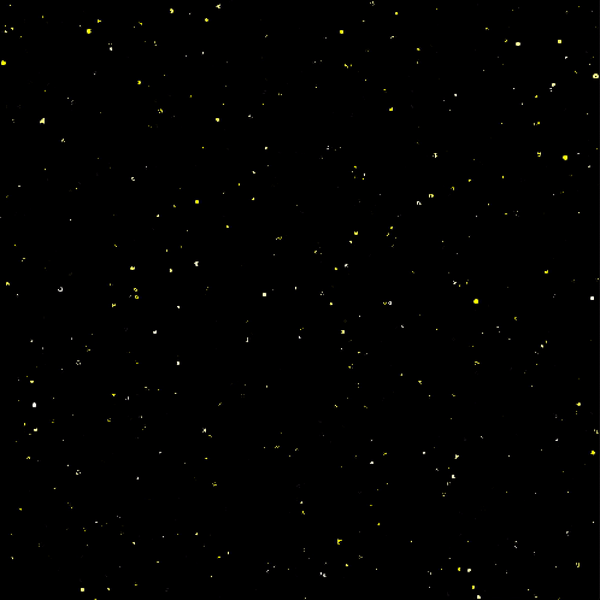

# genuary-2022

https://genuary.art/

Not sure how many of these I'll do...

## Day 1 - Draw 10,000 of something

A bunch of dots / circles positioned using normal dist.

## Day 3 - Space

To be honest day 1 could have been space.

I played around with a bunch of different stuff, in the end I went with starting and fading stars by drawing circles at random (with randomised size and colour) and then drawing black circles over them at random (faster than I added them).

